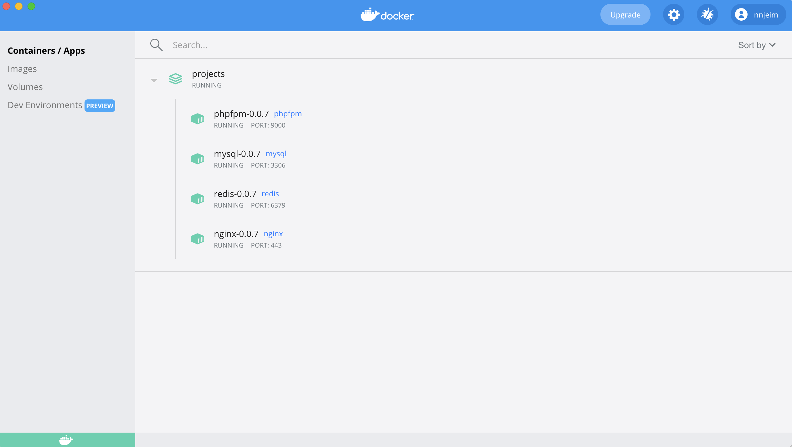

## Docker LEMP  

Docker containers offering  
* Web service with nginx
* Mysql database with phpMyAdmin
* Redis caching



### Docker services
* nginx with *.local.test wildcard certificates
* phpfpm
* mysql
* phpmyadmin as nginx host (phpmyadmin.local.test)
* redis

### Installation
* Copy .env.example into .env
* Set the platform to linux/arm64/v8 for mac M1 processors otherwise set it to linux/amd64 
* Run docker compose build
* Run docker compose up -d

### Helpers
Located in the helpers folder, the helper functions are aliasing one or many docker commands.

#### stop
Helper to stop a service and its related container.
```
./helpers/stop [service]
```

#### start
Helper to start a service and its related container.
```
./helpers/start [service]
```

#### rebuild
Helper to stop a service and its related container then rebuild it.
```
./helpers/rebuild [service]
```

### Development
The projects folders should be placed in the app folder

### Todo List
* script to create a new vhost, issue a certificate and rebuild the web service.
* application setup helpers. Ex. install laravel, wp...etc...
